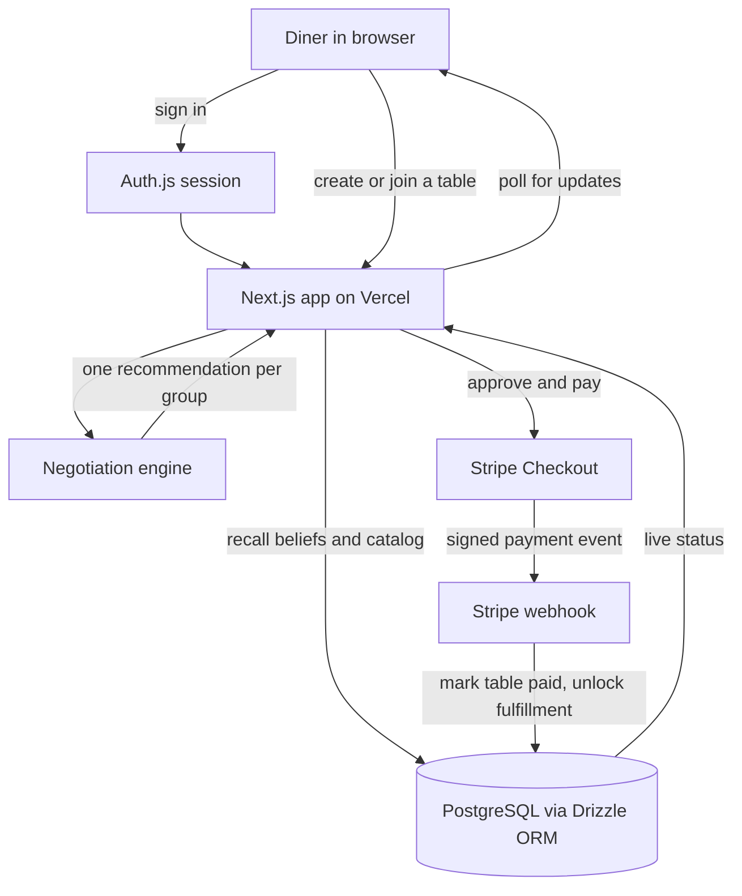

# OneTable

**A memory powered group dining agent.** OneTable remembers what every diner in your group can and cannot eat, negotiates one order that works for everyone, and handles payment and fulfillment end to end.

[](https://one-table-silk.vercel.app)


**Live app:** **[https://one-table-silk.vercel.app](https://one-table-silk.vercel.app)**

---

## What it does

Planning where a group eats usually means texting everyone, remembering who is allergic to what, and manually splitting the bill. OneTable does this automatically.

1. One person creates a table and shares a link.
2. Everyone joins with their own account.
3. OneTable recalls each diner's dietary needs and picks one restaurant and one dish per diner that works for the whole group.
4. If someone corrects a belief, like a new allergy, the recommendation updates instantly for everyone.
5. The group approves, pays with a real Stripe checkout, and tracks fulfillment live.
6. Feedback after the meal feeds back into memory for next time.

---

## Features

### Group coordination
- Create a table with a dining intent, such as "quick lunch, around $20 each"
- Share one link. Anyone can join with their own account
- No fixed guest list and no re-entering preferences every time

### Smart recommendations
- One negotiation engine picks a restaurant and dish per diner
- Every diner's allergies, diet, budget, goals, and preferences are satisfied at once
- The recommendation re-runs automatically the moment someone joins or corrects a belief

### Persistent memory
- Diner constraints are remembered across sessions and devices
- Belief corrections are versioned. The old value is kept, not erased
- A dedicated profile page proves memory survives a completely fresh sign in

### Real payments
- Real Stripe Checkout in test mode, not a fake payment screen
- Bill splits automatically based on what each diner actually ordered
- Payment is only confirmed after a signed Stripe webhook, never trusted from the browser

### Live status
- The table page updates live as the recommendation is negotiated
- Fulfillment progress is shown step by step, from submitted to delivered
- No manual refreshing required

### Feedback loop
- Diners rate their dish once the order is fulfilled
- Feedback is saved to group history and considered in future recommendations

### Admin tools
- A dedicated admin panel to manage restaurants and menu items
- Restricted to admin accounts only

### Accounts and security
- Real email and password sign up and sign in
- Every route and API endpoint is protected by middleware
- Passwords are hashed and never stored in plain text

---

## Architecture



The app never trusts the browser for anything that matters. Sign in, belief recall, and payment confirmation all happen through the server and are verified against the database or Stripe's signature.

---

## Tech stack

| Tool | Purpose |
| --- | --- |
| Next.js 16 (App Router) | Framework for pages, API routes, and server rendering |
| React 19 | UI components |
| TypeScript | Type safety across the frontend, backend, and database layer |
| PostgreSQL | Primary database, hosted on Vercel in production |
| Drizzle ORM | Type-safe schema, queries, and versioned SQL migrations |
| Auth.js (NextAuth v5) | Email and password authentication, session management |
| bcryptjs | Password hashing |
| Stripe | Real checkout sessions and signed webhooks, test mode only |
| Vitest | Unit and integration tests |
| ESLint | Code linting |
| Docker | Local PostgreSQL for development |
| Vercel | Hosting and deployment |

---

## Run it locally

1. Install dependencies.
   ```bash
   npm install
   ```
2. Start a local Postgres database.
   ```bash
   docker compose up -d
   ```
3. Copy the example environment file and fill in the values.
   ```bash
   cp .env.example .env.local
   ```
4. Run migrations and seed the restaurant catalog.
   ```bash
   npm run db:migrate
   npm run db:seed
   ```
5. Start the app.
   ```bash
   npm run dev
   ```
6. Open [http://localhost:3000](http://localhost:3000).

### Testing

```bash
npm run typecheck
npm run lint
npm test
```

### Admin access

There is no self-service admin toggle. Make an account an admin directly in the database:

```sql
update users set is_admin = true where email = 'you@example.com';
```

---

## Project structure

```
src/
  app/            Pages and API routes (Next.js App Router)
  components/     UI components
  domain/         Shared domain types
  features/       Core logic: negotiation, checkout, memory, fulfillment
  server/         Table orchestration and identity helpers
  db/             Drizzle schema, migrations, and seed script
  auth.ts         Auth.js configuration
  proxy.ts        Route protection middleware
```
